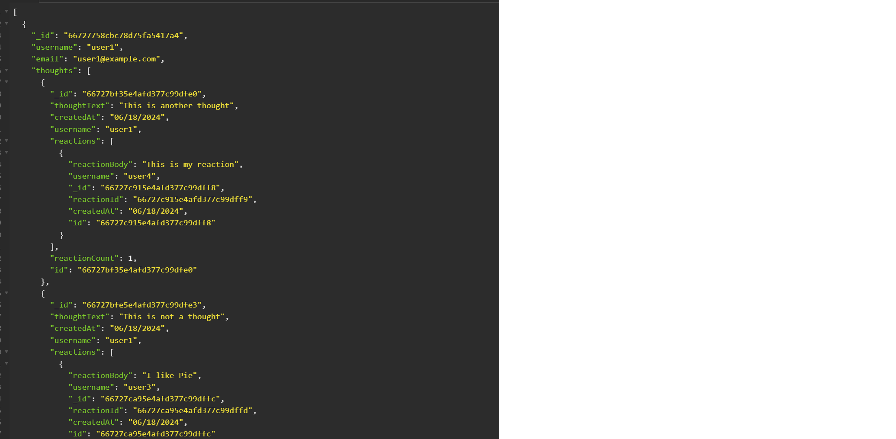

# Social Network Back-End

## Description

This application is designed to function as a back end for a social networking application

## Table of Contents

- [Installation](#installation)
- [Usage](#usage)
- [License](#license)
- [Contributing](#contributing)
- [Tests](#tests)
- [Questions](#questions)

## Installation

fork from my github

## Usage

To track a backend for a social media platform including users thoughts and friends

## Screenshot

## Example Video

## License

https://opensource.org/licenses/MIT

This project is licensed under the MIT License.

## Contributing

n/a

## Tests

n/a

## Questions

If you have any questions about this project, you can reach me at orion.m.cannon@gmail.com
or you can find me on GitHub at [OrionC11](https://github.com/OrionC11).
